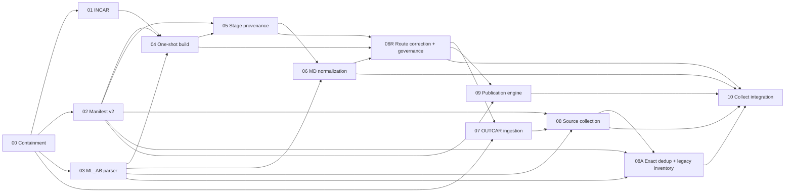

# Code Review Follow-up Implementation Roadmap

Date: 2026-07-11

Status: approved roadmap under implementation. Dynamic progress and the unique
active execution unit live only in ignored `IMPLEMENTATION-STATUS.local.md`.

Approved designs:

- [`2026-07-11-code-review-followup-decomposition-design.md`](../../specs/2026-07-11-code-review-followup-decomposition-design.md)
- [`2026-07-12-mlff-full-dedup-legacy-collection-design.md`](../../specs/2026-07-12-mlff-full-dedup-legacy-collection-design.md)
- [`2026-07-12-code-review-followup-route-correction-and-low-reasoning-execution-design.md`](../../specs/2026-07-12-code-review-followup-route-correction-and-low-reasoning-execution-design.md)

Reusable execution prompts:

- Sol planning, capsule, review, and commit:
  [`ORCHESTRATOR-EXECUTION-PROMPT.md`](ORCHESTRATOR-EXECUTION-PROMPT.md)
- Luna bounded TDD execution:
  [`WORKER-EXECUTION-PROMPT.md`](WORKER-EXECUTION-PROMPT.md)

Authoritative requirement index:
[`docs/code-review-notes/README.md`](../../../code-review-notes/README.md)

Design checkpoints: `01b1b49`, `54e9886`, `db9c842`, `b4d3ab9`;
authoritative amendment: `d69a15b`

## Objective

Implement the confirmed code-review follow-up without creating one oversized
change, duplicating shared contracts, or reopening deferred automation. The work
is divided into thirteen leaf plans, counting the blocking Plan 06R correction
and bounded Plan 08A amendment. Each leaf plan has a bounded done state,
test-first tasks, explicit dependencies, and a review/rollback checkpoint.

The implementation is complete only after blocking Plan 06R, Plan 08A, Plan 10,
and the final integration gate.
Completion of an earlier plan must not be described as completion of the full
follow-up.

## Execution Rules

1. Execute plans in dependency order. A wave describes semantic parallelism, not
   permission to edit the same worktree concurrently.
2. Start every behavior change with a focused test that fails for the intended
   reason.
3. Use the explicitly verified project interpreter. On this workstation:

   ```powershell
   $python = 'C:\Users\Nice_Try\anaconda3\envs\vdwID\python.exe'
   & $python -c "import sys; print(sys.executable)"
   $env:PIP_NO_CACHE_DIR = '1'
   ```

4. Do not install or change Python/conda packages without separate user approval.
5. Preserve unrelated working-tree changes. Stage and commit only files named by
   the active task.
6. Do not use `example-test/` as an automated test dependency and never stage a
   POTCAR.
7. Keep `stage: all` and submitted `--wait` fail-closed throughout this roadmap.
8. If implementation reveals a contradiction in an authoritative note, stop and
   update the spec with user approval. Do not silently choose a new scientific or
   recovery rule inside production code.
9. Do not start a dependent plan while its predecessor acceptance tests are red.
10. Run the focused/affected suites after each execution unit. Run the full suite
    before every checkpoint commit and every leaf-plan checkpoint. The original
    pre-implementation baseline was 93 passed and 5 skipped; it is historical
    evidence, not the expected count for later runs.
11. After Plan 06R Task 1, keep two persistent model-specific threads: Sol / Max /
    Standard plans, issues capsules, reviews, stages, commits, and updates active
    state; Luna / Max / Standard executes bounded TDD and returns unstaged changes.
12. Use a serial handoff and one write-capable thread at a time in the shared
    worktree. Parallel agents are limited to independent read-only exploration,
    tests, or review.

## Historical Pre-implementation Repository Gate

This gate defined the original repository entry condition and is not an active
execution step. Before Plan 00 production work began, its approved scope was:

- `.gitignore` root rule `/example-test/`;
- `docs/2026-07-11-code-review.md`;
- `docs/code-review-notes/`;
- this roadmap and its leaf plans.

Do not include `example-test/`, POTCARs, generated build output, or unrelated user
changes in that commit.

## Test-material Availability

The ignored local samples provide candidate source material for later parser
plans. Before Plans 03, 07, 08, or 08A use the newer walltime/restart tree, read its
local evidence record when present:

`example-test/0-walltime_restart/README.md`

That partial tree is about 544 MB and includes POTCAR files, so it remains local
and must never be staged or used as a direct automated-test dependency. Its
relevant evidence is:

- three MD OUTCAR segments that naturally ended without a timing footer, after
  hundreds of complete force/free-energy blocks and inside later electronic
  output;
- VASP 6.5.1 complete ML_AB/ML_ABN snapshots for `md/0_0` and `md/0_1`, plus an
  existing ignored VASP 6.4.1 ML_ABN sample elsewhere in the local corpus;
- `md/0_0/OUTCAR0` records a fresh on-the-fly start and the later `OUTCAR`
  records restart mode; `md/0_1/OUTCAR` records a fresh start;
- the user confirmed that this calculation did not use the supplied
  `init_mlff/ML_ABN`/`ML_FFN` as the MD starting database;
- the retained current `md/0_0/ML_AB` has a smaller count than final ML_ABN, but
  its exact copy-time provenance is not required and must not be invented;
- the `init_mlff/ML_ABN` reference also differs in configuration count and
  maximum system size from current `md/0_0/ML_AB`, reinforcing that directory
  proximity is not seed identity.

All supplied ML_ABN snapshots end in complete stress blocks. Therefore, Plans 03
and 08 must create explicitly labelled controlled crops for ML_ABN tail
truncation unless a naturally incomplete file is supplied later. Plans 07 and 08
may derive minimal sanitized OUTCAR fixtures from the natural walltime tails, but
must prove parser frame/error behavior rather than infer it from block counts or
the missing footer alone.

Plan 03 may derive minimal VASP 6.4.1/6.5.1 format fixtures. Plan 08A must use a
portable synthetic/cropped fresh-start restart regression rather than treating
the current ML_AB as a proven historical copy. The raw sample is corroborating
evidence, not an automated test oracle.

Raw files remain ignored and must never be staged. Every derived fixture must be
minimal, sanitized, redistributable, and documented in its tracked
`tests/data/.../README.md`. Additional large files are not a prerequisite for
Plan 02 or for beginning the parser plans; request more material only when the
existing source cannot represent an authoritative format boundary.

## Plan Index

| ID | Plan | Authoritative scope | Depends on | Unlocks |
| --- | --- | --- | --- | --- |
| 00 | [Containment baseline](00-containment-baseline.md) | P0, P1-2, independent test gaps | approved plans | 01, 02, 03, 07 |
| 01 | [INCAR engine](01-incar-engine.md) | P1-4 | 00 | 04 |
| 02 | [Manifest v2](02-manifest-v2.md) | shared P1-5/P2-2/P2-3/P2-6 contracts | 00 | 04, 05, 08, 08A, 09 |
| 03 | [ML_AB parser and identities](03-mlab-parser-digest.md) | P2-1 parsing/identity core | 00 | 04, 06, 08, 08A |
| 04 | [One-shot build](04-one-shot-build.md) | P2-2 | 01, 02, 03 | 05, 06R |
| 05 | [Stage provenance](05-stage-provenance.md) | P1-5 | 02, 04 | 06, 06R |
| 06 | [MD normalization and seed staging](06-md-normalization-seed-staging.md) | P1-1, P1-6, P2-1 producer side | 03, 05 | 06R |
| 06R | [Route correction and execution governance](06r-route-correction-execution-governance.md) | audited P1-1/P1-5/P2-2 corrections and progressive execution | 04, 05, 06 | 07, 09, 10 |
| 07 | [OUTCAR ingestion](07-outcar-ingestion.md) | P2-4, P2-5 | 00, 06R | 08 |
| 08 | [Per-source collection](08-source-collection.md) | P2-1 source classification and seed-aware consumer | 02, 03, 07 | 08A, 10 |
| 08A | [MLFF full-dedup and legacy inventory](08a-mlff-full-dedup-legacy-collection.md) | P2-1 exact optional consumer; P2-6 missing-manifest exception | 02, 03, 08 | 10 |
| 09 | [Collection publication engine](09-collection-publication-engine.md) | P2-3 persistence engine | 02, 06R | 10 |
| 10 | [Collect integration and CLI](10-collect-integration-cli.md) | P2-3 orchestration, P2-6 | 06, 06R, 08, 08A, 09 | final gate |

## Dependency Graph



## Execution Waves

Waves express dependency shape, not dynamic progress. Runtime progress is read
only from the ignored active-state snapshot.

### Waves 0–4: Established Build Foundation

- Wave 0: Plan 00 containment.
- Wave 1: Plans 01, 02, and 03 reusable parsing/persistence contracts.
- Wave 2: Plan 04 one-shot build and aggregate preflight.
- Wave 3: Plan 05 strict and legacy Stage provenance.
- Wave 4: Plan 06 MD normalization, anchors, and seed producer.

### Wave 4R: Blocking Route Correction

- Plan 06R: restore the audited manifest/preflight/module contracts and bootstrap
  progressive orchestrator/worker execution.

No Plan 07 or Plan 09 production work begins before the Plan 06R final gate.

### Wave 5: Collection Inputs and Publication Core

- Plan 07: deterministic OUTCAR discovery and streaming.
- Plan 09: collection publication engine and recovery state machine.

These plans are semantically independent after Plan 06R, but a shared worktree
still uses one write-capable agent at a time. Plan 09 and Plan 10 should normally
share one PR unless the project explicitly accepts a tested but temporarily
unwired internal publication API.

### Wave 6

- Plan 08: per-source collection semantics after Plan 07.

### Wave 6A

- Plan 08A: exact MLFF full-dedup and bounded legacy/missing inventory after Plan
  08. Keep its checkpoint separate, but merge it with Plan 10 if project policy
  rejects an unwired optional mode.

### Wave 7

- Plan 10: wire the prepared producer, collectors, publication, manifest status,
  and CLI outcomes; then run the final integration gate.

## Shared Production Boundaries

The following names are coordination targets for the leaf plans. A leaf plan may
refine private helper names, but must not create a competing contract.

### `src/dpmoire_lite/incar.py`

Owns parsing, statement locations, duplicate analysis, effective-value queries,
and conservative rendering. `inputs.py` remains the VASP-file orchestration layer
and delegates INCAR semantics to this module.

### `src/dpmoire_lite/atomic_io.py`

Owns reusable same-filesystem candidate creation, file flush/fsync, SHA-256, and
atomic text/YAML publication primitives. It does not own collect locking or the
P2-3 journal state machine.

### `src/dpmoire_lite/manifest.py`

Owns Manifest v2 schema validation and strict current/legacy/missing/invalid
classification. It does not create a new manifest when reading fails.

Required schema extension points include:

- `schema_version`;
- Stage0 structure provenance and grid-shift anchors;
- Stage1 MLFF seed identity;
- per-source collection diagnostics;
- aggregate collect outcome and transaction identity.

### `src/dpmoire_lite/mlab.py`

Owns ML_AB/ML_ABN structured parsing, EOF classification, canonical
configuration serialization, `mlab-seed-v1` prefix identity, and
`mlab-config-v1` exact per-configuration identity. Adding the latter must not
change existing seed digest semantics.
`dataset.py` converts accepted parsed configurations into ASE objects; it does not
parse the raw format itself after Plan 03.

### `src/dpmoire_lite/inputs.py`

Owns VASP input preparation and publication helpers. Plan 06R makes it return
prepared INCAR, POTCAR, submit-script, and vdW source records with byte identity;
generation consumes those records instead of reselecting or reparsing sources.

### `src/dpmoire_lite/build_preflight.py`

Owns target-stage discovery, conflict checks, aggregated preflight diagnostics,
the no-side-effect boundary, and construction of one prepared build result.
Domain modules provide validators and prepared values; this module orders them
before generation but does not implement their scientific rules.

### `src/dpmoire_lite/provenance.py`

Owns structure fingerprints, Stage0 manifest/anchor evidence, strict current
Stage1 validation, deterministic legacy atom-count/cell inference, and provenance
domain results/issues. `build_preflight.py` aggregates those issues and `build.py`
consumes the validated result instead of interpreting config independently.

### `src/dpmoire_lite/collect_models.py`

Owns structured source and aggregate results. Required vocabulary:

- source: `complete`, `partial`, `skipped`, `failed`;
- aggregate: `complete`, `degraded`, `no_data`, `fatal`.
- MLFF collection mode: `seed-aware`, `full-dedup`;
- inventory coverage: known or unknown;
- exact-dedup seen/unique/duplicate count invariants.

The CLI must map an aggregate enum to an integer directly; it must not infer
status from log messages or manifest text.

### `src/dpmoire_lite/mlff_collect.py`

Owns the optional full-dedup fold and bounded MLFF inventory adapter. It consumes
Plan 08 finalized parsed source payloads and Plan 03 identities, retains the
deterministic first occurrence, and scans a missing manifest only for explicit
full-dedup. It does not parse CLI arguments, publish output, or infer VASP mode
from INCAR/OUTCAR/current ML_AB.

### `src/dpmoire_lite/collect_publish.py`

Owns the P2-3 single-writer lock, candidates, backups, journal, recovery table,
and publication. It exposes a publication session that acquires the lock and
recovers any existing transaction before the caller starts a new source
collection. The caller later supplies an already classified `CollectResult` to
the same held session. The module does not parse VASP files or choose source
status. It validates a closed result-manifest target: current stage Manifest v2
or exact MLFF compatibility path `work_dir/MD_data.collect.yaml`; arbitrary paths
are rejected.

### `src/dpmoire_lite/collect.py`

Remains the orchestration layer: load config and the strict manifest, open the
publication session, finish any recovery, enumerate declared sources while the
session lock remains held, build a candidate dataset, choose the aggregate result,
and ask that same session to publish it. The only missing-manifest exception is
delegated to Plan 08A after mode validation.

## Spec-to-Plan Traceability

| Spec | Primary plan(s) | Final closing gate |
| --- | --- | --- |
| P0 repository hygiene | 00; execution governance in 06R; fixture work in 03 and 07 | 10 packaging/git audit |
| P1-1 MD constraints | 02 schema; 06 behavior; 06R top-level anchor correction | 10 producer/consumer regression |
| P1-2 safety gate | 00 | remains active after 10 |
| P1-4 INCAR rendering | 01 engine; 04 preflight; 06R single prepared consumption | 06R no-side-effect gate |
| P1-5 Stage provenance | 02 schema; 05 behavior; 06R warning and ownership correction | 06R Stage1 regression |
| P1-6 MD velocities | 06 | 06 focused and full suites |
| P2-1 partial/seed/exact mode | 03 parser/identity; 06 producer; 08 seed-aware consumer; 08A full-dedup | 10 both-mode end-to-end contract |
| P2-2 one-shot build | 02 strict manifest; 04 lifecycle; 05/06 validators; 06R authoritative prepared result | 06R preflight regression |
| P2-3 safe publication | 02 atomic primitives; 09 engine; 10 orchestration | 10 fault-injection integration |
| P2-4 OUTCAR patterns | 07 | 08 source-order manifest tests |
| P2-5 OUTCAR streaming | 07 | 08 partial/source tests |
| P2-6 collect exit codes | 02 classification; 08 source results; 08A coverage evidence; 09 result targets; 10 aggregate/CLI | 10 CLI integer assertions |
| Testing/tooling scope | every plan; progressive execution in 06R | final gate below |

## Per-Task TDD Contract

The checkpoint boundary is a TDD execution unit:

- normally one task that contains both RED and GREEN;
- or one adjacent pair where the first task only adds failing tests and the next
  task implements exactly those tests.

Do not execute more than one unit per model run. Do not jump over an unrelated
task to reach the implementation for an earlier RED test. A task must not add
tests assigned to a later, nonadjacent task.

Each execution unit uses this sequence:

1. Name exact test files and test functions.
2. Add the smallest fixture required by those tests.
3. Run a focused command and observe a failure caused by the missing behavior, not
   an import typo or private-data skip.
4. Implement only that behavior.
5. Run the focused command to green.
6. Run the affected subsystem tests.
7. Run the full suite before the checkpoint commit and leaf-plan checkpoint.
8. Inspect `git diff --check` and `git status --short`.

All tests included in a commit must pass. Future-task RED tests must remain absent
from default discovery and must never be staged. A temporary untracked RED file
may be excluded only by an explicit, recorded migration amendment; the regression
command must then use `--ignore=<exact-untracked-file>`, and the staged tree must
contain no failing test.

Standard commands:

```powershell
$python = 'C:\Users\Nice_Try\anaconda3\envs\vdwID\python.exe'
$env:PIP_NO_CACHE_DIR = '1'

& $python -m pytest <focused-tests> -q -p no:cacheprovider
& $python -m pytest -q -p no:cacheprovider
git diff --check
git status --short
```

Do not use bare `python` or `python3`.

## Commit and Review Boundaries

- A task may end in one focused commit after both its focused and affected suites
  pass.
- A leaf plan ends in a review checkpoint with the full suite passing.
- Do not mix red tests for a later leaf plan into a production commit for the
  current plan unless they are explicitly marked and kept outside the default
  suite; the preferred approach is to add them when their plan starts.
- Plans 03 and 09 create reusable internal components. If project policy rejects
  merging unused internal APIs, merge Plan 03 with its first Plan 04 consumer and
  Plan 09 with Plan 10, while keeping separate commits and review checklists.
- Plan 08A creates an optional internal mode consumed only in Plan 10. If an
  unwired merge is disallowed, keep the Plan 08A checkpoint commit separate but
  merge it together with Plan 10.
- Do not rewrite or squash user-owned commits without explicit approval.

## Final Integration Gate

After Plan 10:

1. Run the full suite in the verified `vdwID` interpreter.
2. Confirm no core parser/collect behavior skips because the private absolute
   sample directory is unavailable.
3. Run the wheel content tests and an `init-example` smoke test.
4. Verify `git check-ignore -v example-test` succeeds.
5. Verify no tracked or wheel file is named POTCAR and no raw `example-test/`
   content is included.
6. Exercise new Stage0 -> Stage1 manifests with both `sc_rlx` modes, default
   constraint clearing, velocity clearing, and seed identity.
7. Exercise complete, degraded, no-data, and fatal collect paths with exact CLI
   integer assertions.
8. Exercise omitted/explicit `seed-aware` equivalence, fresh-start full-dedup,
   repeated-seed exact removal, legacy declared inventory, and missing-manifest
   degraded scan.
9. Verify exact dedup retains near/scientifically changed frames, uses one
   identity per complete configuration, and never calls a pairwise/fuzzy path.
10. Run all P2-3 fault-injection and recovery-table cases for both current and
    compatibility result-manifest targets.
11. Validate sanitized VASP 6.4.1 and 6.5.1 ML_ABN fixtures.
12. Validate ASE 3.28 locally. Record ASE 3.29 as external validation unless an
   existing environment is available or environment modification is approved.
13. Inspect the final diff against the traceability table and confirm every spec
    acceptance criterion maps to a passing test or explicit audit command.

## Definition of Complete

The follow-up is complete only when:

- Plans 00 through 10, including blocking Plan 06R and bounded Plan 08A, are
  implemented in dependency order;
- all focused and full tests pass;
- the final integration gate passes;
- the approved notes and bundled examples match production behavior;
- the unsafe Slurm automation remains fail-closed;
- no core result relies on private local fixtures;
- no pending or committed collect journal is left unexplained by the documented
  recovery contract;
- the project leader has reviewed the final implementation and traceability
  report.
