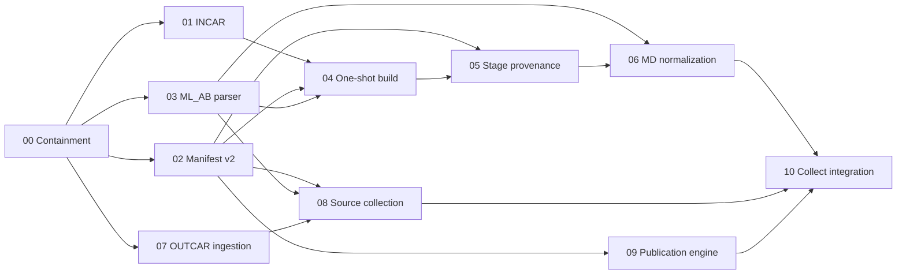

# Code Review Follow-up Implementation Roadmap

Date: 2026-07-11

Status: implementation plans drafted from the approved decomposition design;
production implementation has not started

Approved design:
[`2026-07-11-code-review-followup-decomposition-design.md`](../../specs/2026-07-11-code-review-followup-decomposition-design.md)

Authoritative requirement index:
[`docs/code-review-notes/README.md`](../../../code-review-notes/README.md)

Design checkpoint: `01b1b49`

## Objective

Implement the confirmed code-review follow-up without creating one oversized
change, duplicating shared contracts, or reopening deferred automation. The work
is divided into eleven leaf plans. Each leaf plan has a bounded done state,
test-first tasks, explicit dependencies, and a review/rollback checkpoint.

The implementation is complete only after Plan 10 and the final integration gate.
Completion of an earlier plan must not be described as completion of the full
follow-up.

## Execution Rules

1. Execute plans in dependency order. A wave describes semantic parallelism, not
   permission to edit the same worktree concurrently.
2. Start every behavior change with a focused test that fails for the intended
   reason.
3. Use the explicitly verified project interpreter. On this workstation:

   ```powershell
   $python = 'C:\Users\Nice_Try\anaconda3\envs\vdwID\python.exe'
   & $python -c "import sys; print(sys.executable)"
   $env:PIP_NO_CACHE_DIR = '1'
   ```

4. Do not install or change Python/conda packages without separate user approval.
5. Preserve unrelated working-tree changes. Stage and commit only files named by
   the active task.
6. Do not use `example-test/` as an automated test dependency and never stage a
   POTCAR.
7. Keep `stage: all` and submitted `--wait` fail-closed throughout this roadmap.
8. If implementation reveals a contradiction in an authoritative note, stop and
   update the spec with user approval. Do not silently choose a new scientific or
   recovery rule inside production code.
9. Do not start a dependent plan while its predecessor acceptance tests are red.
10. Run the focused suite after each task and the full suite at each leaf-plan
    checkpoint. The current baseline is 93 passed and 5 skipped.

## Pre-implementation Repository Gate

The approved review corpus is currently a working-tree change. Before Plan 00
production work begins, intentionally review and version only the approved scope:

- `.gitignore` root rule `/example-test/`;
- `docs/2026-07-11-code-review.md`;
- `docs/code-review-notes/`;
- this roadmap and its leaf plans.

Do not include `example-test/`, POTCARs, generated build output, or unrelated user
changes in that commit.

## Plan Index

| ID | Plan | Authoritative scope | Depends on | Unlocks |
| --- | --- | --- | --- | --- |
| 00 | [Containment baseline](00-containment-baseline.md) | P0, P1-2, independent test gaps | approved plans | 01, 02, 03, 07 |
| 01 | [INCAR engine](01-incar-engine.md) | P1-4 | 00 | 04 |
| 02 | [Manifest v2](02-manifest-v2.md) | shared P1-5/P2-2/P2-3/P2-6 contracts | 00 | 04, 05, 08, 09 |
| 03 | [ML_AB parser and digest](03-mlab-parser-digest.md) | P2-1 parsing/identity core | 00 | 04, 06, 08 |
| 04 | [One-shot build](04-one-shot-build.md) | P2-2 | 01, 02, 03 | 05 |
| 05 | [Stage provenance](05-stage-provenance.md) | P1-5 | 02, 04 | 06 |
| 06 | [MD normalization and seed staging](06-md-normalization-seed-staging.md) | P1-1, P1-6, P2-1 producer side | 03, 05 | 10 |
| 07 | [OUTCAR ingestion](07-outcar-ingestion.md) | P2-4, P2-5 | 00 | 08 |
| 08 | [Per-source collection](08-source-collection.md) | P2-1 consumer side | 02, 03, 07 | 10 |
| 09 | [Collection publication engine](09-collection-publication-engine.md) | P2-3 persistence engine | 02 | 10 |
| 10 | [Collect integration and CLI](10-collect-integration-cli.md) | P2-3 orchestration, P2-6 | 06, 08, 09 | final gate |

## Dependency Graph



## Execution Waves

### Wave 0

- Plan 00: freeze the approved repository/spec baseline and close unsafe automated
  entry points.

### Wave 1

- Plan 01: INCAR parser and build-preflight adapter.
- Plan 02: Manifest v2 and atomic persistence primitives.
- Plan 03: ML_AB/ML_ABN parser and canonical seed digest.
- Plan 07: deterministic OUTCAR discovery and streaming.

These plans have no semantic dependency on one another. Plans 01 and 07 both
touch `config.py`, so a single implementer should still execute them sequentially
or rebase carefully.

### Wave 2

- Plan 04: one-shot build and aggregate preflight.
- Plan 08: per-source collection semantics using synthetic Manifest v2 fixtures.
- Plan 09: collection publication engine and recovery state machine.

Plan 09 and Plan 10 should normally share one PR unless the project explicitly
accepts a tested but temporarily unwired internal publication API.

### Wave 3

- Plan 05: Stage0/Stage1 structure provenance and legacy inference.

### Wave 4

- Plan 06: MD constraint/velocity normalization and real Stage1 seed producer.

### Wave 5

- Plan 10: wire real producers, source collection, publication, manifest status,
  and CLI exit codes; then run the final integration gate.

## Shared Production Boundaries

The following names are coordination targets for the leaf plans. A leaf plan may
refine private helper names, but must not create a competing contract.

### `src/dpmoire_lite/incar.py`

Owns parsing, statement locations, duplicate analysis, effective-value queries,
and conservative rendering. `inputs.py` remains the VASP-file orchestration layer
and delegates INCAR semantics to this module.

### `src/dpmoire_lite/atomic_io.py`

Owns reusable same-filesystem candidate creation, file flush/fsync, SHA-256, and
atomic text/YAML publication primitives. It does not own collect locking or the
P2-3 journal state machine.

### `src/dpmoire_lite/manifest.py`

Owns Manifest v2 schema validation and strict current/legacy/missing/invalid
classification. It does not create a new manifest when reading fails.

Required schema extension points include:

- `schema_version`;
- Stage0 structure provenance and grid-shift anchors;
- Stage1 MLFF seed identity;
- per-source collection diagnostics;
- aggregate collect outcome and transaction identity.

### `src/dpmoire_lite/mlab.py`

Owns ML_AB/ML_ABN structured parsing, EOF classification, canonical
`mlab-seed-v1` serialization, and seed-prefix verification primitives.
`dataset.py` converts accepted parsed configurations into ASE objects; it does not
parse the raw format itself after Plan 03.

### `src/dpmoire_lite/build_preflight.py`

Owns target-stage discovery, conflict checks, aggregated preflight diagnostics,
and the no-side-effect boundary. Domain modules provide validators; this module
orders them before generation.

### `src/dpmoire_lite/provenance.py`

Owns structure fingerprints, Manifest v2 Stage0 provenance validation, and legacy
atom-count/cell inference. `build.py` consumes its result instead of interpreting
the current config independently.

### `src/dpmoire_lite/collect_models.py`

Owns structured source and aggregate results. Required vocabulary:

- source: `complete`, `partial`, `skipped`, `failed`;
- aggregate: `complete`, `degraded`, `no_data`, `fatal`.

The CLI must map an aggregate enum to an integer directly; it must not infer
status from log messages or manifest text.

### `src/dpmoire_lite/collect_publish.py`

Owns the P2-3 single-writer lock, candidates, backups, journal, recovery table,
and publication. It exposes a publication session that acquires the lock and
recovers any existing transaction before the caller starts a new source
collection. The caller later supplies an already classified `CollectResult` to
the same held session. The module does not parse VASP files or choose source
status.

### `src/dpmoire_lite/collect.py`

Remains the orchestration layer: load config and the strict manifest, open the
publication session, finish any recovery, enumerate declared sources while the
session lock remains held, build a candidate dataset, choose the aggregate result,
and ask that same session to publish it.

## Spec-to-Plan Traceability

| Spec | Primary plan(s) | Final closing gate |
| --- | --- | --- |
| P0 repository hygiene | 00; fixture work in 03 and 07 | 10 packaging/git audit |
| P1-1 MD constraints | 02 schema location; 06 anchor provenance and behavior | 10 producer/consumer regression |
| P1-2 safety gate | 00 | remains active after 10 |
| P1-4 INCAR rendering | 01; preflight wiring in 04 | 04 no-side-effect integration |
| P1-5 Stage provenance | 02 schema; 05 validation/inference | 06 Stage1 integration |
| P1-6 MD velocities | 06 | 06 focused and full suites |
| P2-1 partial/seed | 03 parser; 06 producer; 08 consumer | 10 end-to-end seed contract |
| P2-2 one-shot build | 02 strict manifest; 04 lifecycle; 05/06 validators | 06 Stage1 preflight regression |
| P2-3 safe publication | 02 atomic primitives; 09 engine; 10 orchestration | 10 fault-injection integration |
| P2-4 OUTCAR patterns | 07 | 08 source-order manifest tests |
| P2-5 OUTCAR streaming | 07 | 08 partial/source tests |
| P2-6 collect exit codes | 02 schema; 08 source results; 10 aggregate/CLI | 10 CLI integer assertions |
| Testing/tooling scope | every plan | final gate below |

## Per-Task TDD Contract

Each task in a leaf plan uses this sequence:

1. Name exact test files and test functions.
2. Add the smallest fixture required by those tests.
3. Run a focused command and observe a failure caused by the missing behavior, not
   an import typo or private-data skip.
4. Implement only that behavior.
5. Run the focused command to green.
6. Run the affected subsystem tests.
7. Run the full suite before the leaf-plan checkpoint.
8. Inspect `git diff --check` and `git status --short`.

Standard commands:

```powershell
$python = 'C:\Users\Nice_Try\anaconda3\envs\vdwID\python.exe'
$env:PIP_NO_CACHE_DIR = '1'

& $python -m pytest <focused-tests> -q -p no:cacheprovider
& $python -m pytest -q -p no:cacheprovider
git diff --check
git status --short
```

Do not use bare `python` or `python3`.

## Commit and Review Boundaries

- A task may end in one focused commit after both its focused and affected suites
  pass.
- A leaf plan ends in a review checkpoint with the full suite passing.
- Do not mix red tests for a later leaf plan into a production commit for the
  current plan unless they are explicitly marked and kept outside the default
  suite; the preferred approach is to add them when their plan starts.
- Plans 03 and 09 create reusable internal components. If project policy rejects
  merging unused internal APIs, merge Plan 03 with its first Plan 04 consumer and
  Plan 09 with Plan 10, while keeping separate commits and review checklists.
- Do not rewrite or squash user-owned commits without explicit approval.

## Final Integration Gate

After Plan 10:

1. Run the full suite in the verified `vdwID` interpreter.
2. Confirm no core parser/collect behavior skips because the private absolute
   sample directory is unavailable.
3. Run the wheel content tests and an `init-example` smoke test.
4. Verify `git check-ignore -v example-test` succeeds.
5. Verify no tracked or wheel file is named POTCAR and no raw `example-test/`
   content is included.
6. Exercise new Stage0 -> Stage1 manifests with both `sc_rlx` modes, default
   constraint clearing, velocity clearing, and seed identity.
7. Exercise complete, degraded, no-data, and fatal collect paths with exact CLI
   integer assertions.
8. Run all P2-3 fault-injection and recovery-table cases.
9. Validate ASE 3.28 locally. Record ASE 3.29 as external validation unless an
   existing environment is available or environment modification is approved.
10. Inspect the final diff against the traceability table and confirm every spec
    acceptance criterion maps to a passing test or explicit audit command.

## Definition of Complete

The follow-up is complete only when:

- Plans 00 through 10 are implemented in dependency order;
- all focused and full tests pass;
- the final integration gate passes;
- the approved notes and bundled examples match production behavior;
- the unsafe Slurm automation remains fail-closed;
- no core result relies on private local fixtures;
- no pending or committed collect journal is left unexplained by the documented
  recovery contract;
- the project leader has reviewed the final implementation and traceability
  report.
