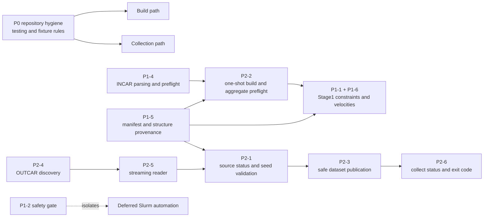
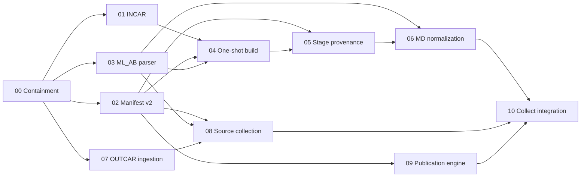

# Code Review Follow-up Implementation Decomposition Design

Date: 2026-07-11

Status: approved in discussion; implementation plans and production code are not yet written

## Purpose

The code-review follow-up is too large for one reliable implementation plan. The
confirmed notes cover build input safety, cross-stage structure provenance,
scientific MD semantics, source parsing, MLFF seed identity, dataset publication,
and CLI outcomes. Several notes share the same manifest and preflight contracts,
while three notes contain stateful algorithms large enough to require their own
implementation boundaries.

This design defines:

- how the confirmed specs relate to one another;
- which contracts are shared instead of reimplemented in multiple fixes;
- how the work is split into independently reviewable leaf plans;
- the dependency order and safe parallel work;
- the required shape and quality gates of each implementation plan.

This document does not change production behavior. The authoritative scientific
and failure-handling decisions remain in
[`docs/code-review-notes/`](../../code-review-notes/README.md).

## Scope Source

The current implementation scope is the set of confirmed notes listed in the
[follow-up index](../../code-review-notes/README.md):

- P0 repository hygiene;
- P1-2 automation safety gate;
- P1-1, P1-4, P1-5, and P1-6 build correctness;
- P2-1 through P2-6 collection correctness and safety;
- the cross-cutting testing and tooling requirements.

The following remain explicitly deferred:

- Slurm terminal-state classification and failure propagation;
- unattended `stage: all` orchestration;
- submitted `--wait`, retry, recovery, and job-state persistence;
- MD restart automation;
- global fuzzy structure deduplication;
- a full CI matrix and repository-wide lint/type-check rollout.

P1-2 keeps the unsafe automated paths fail-closed until the deferred Slurm design
is implemented and accepted.

## Decomposition Decision

Three organizations were considered.

### One implementation plan for all notes

This gives one execution sequence, but it creates a plan too large to review or
hold in context. A failure in the P2-3 publication transaction would delay
independent build correctness fixes, and the resulting change would be difficult
to bisect or roll back.

### One implementation plan per note

This provides simple issue traceability, but the note boundaries are not always
implementation boundaries. P1-1 requires P1-5 anchor provenance. P2-1 spans both
Stage1 seed distribution and collection-time source validation. P2-3 and P2-6
share one result contract. A strict one-note-per-plan rule would repeatedly edit
the same shared interfaces and temporarily create conflicting contracts.

### Dependency-oriented leaf plans

Use one roadmap plus eleven leaf plans. Combine notes when they change one
cohesive behavior, and split a note when it contains an independently testable
parser, state machine, or producer/consumer boundary.

This is the selected approach.

Each leaf plan is an independently reviewable execution and rollback checkpoint.
It is also a candidate PR boundary, but plans are not required to map one-to-one
to PRs. Two adjacent plans may share a PR when merging the first alone would add
an intentionally unused internal component. Their task lists, tests, and review
checkpoints must remain separate.

## System Relationships

The specs form two product paths, plus shared safety and persistence contracts.



### Build path

P1-4 provides a safe, reusable INCAR parse and analysis result. P2-2 consumes
that result as part of the no-side-effect preflight and defines stage directories
as one-shot outputs. P1-5 makes the Stage0 manifest the source of truth for
Stage1 structure interpretation. P1-1 and P1-6 then normalize the Stage1 MD
structure using verified provenance instead of incidental ASE propagation.

P2-1 also enters the build path: Stage1 must parse the complete initial MLFF seed,
record its count and canonical digest, copy it with byte-level verification, and
store the immutable seed identity in the MD manifest.

### Collection path

P2-4 decides which OUTCAR segments are selected and in which deterministic
order. P2-5 reads each selected segment through a context-managed, file-object
iterator and applies sampling before retaining frames. P2-1 decides whether each
ML_ABN or OUTCAR source is complete, partial, or failed and verifies the initial
MLFF seed prefix.

P2-3 receives the resulting candidate dataset and source diagnostics. It does not
reinterpret scientific source validity. It owns locking, candidate validation,
backup, journal recovery, and publication. P2-6 maps the completed collect result
to a structured status and, only at the CLI boundary, to an integer exit code.

### Shared contracts

The following contracts must have one implementation and one test vocabulary:

1. **Manifest schema and persistence**
   - explicit schema version;
   - strict distinction between missing, legacy, invalid, and current manifests;
   - atomic YAML publication;
   - safe relative-path validation;
   - extension points for structure provenance, grid-shift anchors, MLFF seed
     identity, and collect transaction metadata.

2. **Atomic file primitives**
   - same-filesystem temporary files;
   - flush/fsync and SHA-256 helpers;
   - atomic replace;
   - directory fsync where supported;
   - clear platform-specific behavior.

   P2-3 may add locking and transaction-specific operations, but it must reuse
   the shared primitives instead of creating a second atomic-write convention.

3. **Source and collect result models**
   - per-source `complete`, `partial`, `skipped`, and `failed` diagnostics;
   - aggregate `complete`, `degraded`, `no_data`, and `fatal` outcomes;
   - accepted frame counts that exactly match the published dataset;
   - no log-text parsing to determine program status.

4. **Preflight boundary**
   - all discoverable errors are aggregated before stage or root artifacts are
     created;
   - target existence checks occur before expensive validation;
   - later plans add validators to the same preflight pipeline rather than adding
     new write-before-check paths.

## Leaf Implementation Plans

### Plan 00: Containment baseline

Authoritative scope: P0, P1-2, and independent baseline quality gaps.

Deliverables:

- root-anchored `/example-test/` ignore and POTCAR/package guards;
- fail-closed `stage: all` and submitted `--wait` before runner or filesystem side
  effects;
- documentation and CLI help that preserve only the fire-and-forget guarantee;
- direct `find_sym_reduced_stackings()` coverage;
- a recorded test baseline and fixture sanitization rules.

This plan does not copy the large local sample into the repository. Parser-specific
fixtures are introduced by the plans that define their minimum required content.

### Plan 01: INCAR engine and preflight adapter

Authoritative scope: P1-4.

Deliverables:

- a focused INCAR parser/analyzer module rather than more line splitting in
  `inputs.py`;
- safe handling of assignments, semicolons, comments, quoting, and continuation;
- controlled-tag rendering and duplicate rules;
- one parse result reused by rendering, duplicate analysis, and vdW detection;
- aggregated, location-aware preflight errors.

### Plan 02: Manifest v2 and atomic persistence

Authoritative scope: shared parts of P1-5, P2-2, P2-3, and P2-6.

Deliverables:

- the versioned manifest contract and strict reader categories;
- atomic manifest writes and shared atomic I/O primitives;
- path-boundary validation;
- schema locations for structure provenance, anchors, seed identity, source
  diagnostics, and collect transaction metadata;
- tests showing that a missing manifest is not silently converted into a new one.

The plan defines producer/consumer contracts without yet implementing all
producers and consumers.

### Plan 03: ML_AB parser and canonical digest

Authoritative scope: the pure parsing and identity core of P2-1.

Deliverables:

- structured ML_AB/ML_ABN configuration parsing;
- exact complete, tail-partial, and internal-corruption classification;
- header-count invariants;
- `mlab-seed-v1` canonical serialization and digest;
- negative-zero normalization, finite-number checks, shape checks, and fixed
  stress units/order;
- sanitized complete and truncated fixtures with redistribution notes.

The parser is tested independently before build or collect orchestration uses it.

### Plan 04: One-shot build and aggregate preflight

Authoritative scope: P2-2.

Dependencies: Plans 01, 02, and 03.

Deliverables:

- calculate and check the complete target-stage set before any modification;
- reject existing empty or non-empty target stages;
- remove ordinary-build backup/rebuild behavior;
- introduce one aggregate preflight pipeline for templates, POTCAR, vdW,
  structures, MLFF inputs, Stage1 inputs, and path boundaries;
- publish the stage manifest only after complete generation;
- require a real manifest for Stage1 and collect instead of using config,
  directory scans, or auxiliary-file fallbacks.

Later provenance and MD plans extend the preflight pipeline, but must not change
its no-side-effect boundary.

### Plan 05: Stage structure provenance

Authoritative scope: P1-5.

Dependencies: Plans 02 and 04.

Deliverables:

- complete Stage0 structure provenance in new relaxation manifests;
- strict Stage1 validation of immutable inputs and generated Stage0 POSCARs;
- manifest-owned `sc_rlx` interpretation;
- deterministic legacy inference using atom composition and in-plane cell
  relations;
- clear success, conflict, and insufficient-evidence outcomes;
- no stacking fallback outside an existing manifest.

### Plan 06: MD structure normalization and seed staging

Authoritative scope: P1-1, P1-6, and the Stage1 producer side of P2-1.

Dependencies: Plans 03 and 05.

Deliverables:

- `preserve_grid_shift_md` configuration and example documentation;
- Stage0 anchor records bound to the verified POSCAR identity;
- explicit constraint clearing by default on every MD path;
- source-index plus image-translation anchor mapping when preservation is enabled;
- unconditional momentum/velocity removal for new bilayer and monolayer MD;
- complete initial seed parsing, canonical digest recording, copy hash checks, and
  immutable MD manifest seed identity.

Constraint handling, velocity handling, and seed staging use one verified Stage1
input model, but remain separate test tasks.

### Plan 07: OUTCAR discovery and streaming

Authoritative scope: P2-4 and P2-5.

Deliverables:

- strict YAML regex-list validation at config load;
- pattern-priority plus natural-name ordering with no mtime dependence;
- selected-file provenance in the collection input result;
- a context-managed `iread_vasp_out` file-object wrapper;
- deterministic handle closing on normal completion, early break, and exception;
- strict decoding and version-agnostic streaming/laziness tests;
- a sanitized multi-frame OUTCAR fixture.

### Plan 08: Per-source collection semantics

Authoritative scope: the collect consumer side of P2-1, consuming P2-4/P2-5.

Dependencies: Plans 02, 03, and 07.

Deliverables:

- structured source results without incremental mutation of the shared dataset;
- complete, partial, skipped, and failed ML_ABN/OUTCAR behavior;
- MLFF initial seed-prefix verification and restart-safe skip count;
- legacy initial-seed recovery only from valid init evidence;
- accepted frame counts and diagnostics suitable for P2-3/P2-6;
- deterministic sampling behavior for each OUTCAR segment.

Synthetic current-version manifests allow this consumer to be tested before the
real Stage1 producer from Plan 06 is wired end to end.

### Plan 09: Collection publication engine

Authoritative scope: the persistence engine of P2-3.

Dependencies: Plan 02.

Deliverables:

- cross-platform OS-level single-writer lock abstraction;
- validated data and manifest candidates;
- old-output hash and atomic backup publication;
- pending and committed journal persistence;
- the deterministic P/C/empty/X recovery table;
- first-publication and committed-journal residual handling;
- fault-injection tests for every publish boundary.

The engine accepts an already decided candidate and source summary. It does not
parse VASP sources or select the aggregate status.

Plan 09 and Plan 10 should normally be merged in one PR unless the project accepts
a fully tested but temporarily unwired internal publication API.

### Plan 10: Collect orchestration and CLI outcomes

Authoritative scope: P2-3 orchestration and P2-6.

Dependencies: Plans 06, 08, and 09.

Deliverables:

- real Stage1 producer/collect consumer seed-contract integration;
- zero-frame manifest-only publication and previous-output preservation;
- nonzero publication through the transaction engine;
- structured aggregate `complete`, `degraded`, `no_data`, and `fatal` results;
- CLI-only mapping to exit codes 0, 2, 3, and 1 respectively;
- fatal errors before the safe manifest-write boundary return exit 1 without
  creating or overwriting a manifest;
- coverage-drop warnings and complete manifest diagnostics;
- end-to-end failure and recovery tests.

## Dependency Graph and Execution Waves



Recommended waves:

1. Wave 0: Plan 00.
2. Wave 1: Plans 01, 02, 03, and 07. They have no semantic dependency on one
   another, although changes to shared files such as `config.py` still require
   ordinary merge coordination.
3. Wave 2: Plans 04, 08, and 09.
4. Wave 3: Plan 05.
5. Wave 4: Plan 06.
6. Wave 5: Plan 10 and final integration verification.

For a single implementer, the same graph is a topological sequence rather than a
request to create parallel branches.

## Leaf Plan Format

Every leaf plan must contain the following sections.

### Metadata

- plan ID and title;
- authoritative note links;
- dependencies and plans unlocked;
- expected review/rollback boundary;
- current baseline commit or predecessor plan.

### Goal and done state

State the externally observable guarantee that becomes true when the plan is
complete. Do not use completion language for behavior that is only scaffolded for
a later plan.

### Scope and non-goals

List both included acceptance criteria and relevant deferred behavior. Repeating
the deferred boundaries in each affected plan prevents accidental Slurm/restart
scope expansion.

### Files and interfaces

Name the exact files to create, modify, and test. Prefer focused modules for new
parsers, provenance logic, and publication state machines instead of continuing
to grow `build.py`, `inputs.py`, or `collect.py` with unrelated responsibilities.

The implementation plan may name proposed interfaces, but it must not paste large
blocks of final production code. Complex state tables and canonical schemas should
link to their authoritative note rather than be rewritten with subtly different
wording.

### Test-driven execution units

Each checkpointed execution unit follows one red/green/refactor cycle. An
execution unit is normally one self-contained task. If a leaf plan explicitly
uses one task only to add failing tests and the immediately following task only to
implement those exact tests, that adjacent pair is one execution unit and one
checkpoint. A RED task must never remain active across an unrelated task.

Each execution unit follows this sequence:

1. add specifically named failing tests and minimal fixtures;
2. run an exact focused command and record the expected reason for failure;
3. implement the smallest behavior needed for those tests;
4. rerun the focused tests and verify they pass;
5. run the affected subsystem and full regression suites;
6. update examples or documentation owned by that behavior;
7. end at a clear review and rollback checkpoint.

A leaf plan should normally contain four to seven tasks and no more than one new
complex state machine. If a draft exceeds that boundary, introduces two
independent algorithms, or carries future-task RED tests across an unrelated
task, it must be split or reordered before implementation.

### Acceptance traceability

Every note acceptance criterion must map to:

- a task;
- a test name or explicit audit command;
- the plan that finally closes the criterion.

Cross-plan criteria may appear in the roadmap matrix, but a leaf plan must not
claim them complete before the final producer/consumer integration test exists.

### Verification and handoff

Record focused tests, the full suite, packaging checks, filesystem/git audits,
and any external validation still required. The handoff must state which safety
gates remain active after the plan.

## Testing and Quality Gates

The current local baseline is 93 passed and 5 skipped. The skipped core parser
tests depend on a private absolute sample path and must be replaced by sanitized
fixtures as their owning parser plans are implemented.

Every leaf plan must:

- begin with a test that fails for the intended reason;
- run focused tests and the full test suite with an explicitly verified
  interpreter;
- avoid depending on `example-test/` or another developer-only path;
- avoid checking serialized floating-point text when a structural semantic check
  is available;
- update wheel/example-content tests when configuration or bundled examples
  change;
- preserve the P1-2 safety gate unless the separately deferred Slurm acceptance
  criteria have all been implemented.

Final integration must additionally verify:

- no core parsing or collection behavior skips because private data is missing;
- the wheel and git index contain no POTCAR or raw `example-test/` data;
- `git check-ignore example-test` succeeds;
- `find_sym_reduced_stackings()` has direct deterministic coverage;
- ASE 3.28 behavior passes locally;
- ASE 3.29 tests assert public semantics rather than incidental formatting or
  propagation behavior;
- actual ASE 3.29 execution is reported as an external validation gate unless an
  existing environment is available or environment changes are separately
  approved;
- P2-3 fault injection covers every journal transition, including committed
  journal persistence before unlink;
- exit codes, manifest status, dataset bytes, and recovery state agree in
  end-to-end collect tests.

## Plan Document Layout

The implementation documents will live under one directory:

```text
docs/superpowers/plans/2026-07-11-code-review-followup/
  README.md
  00-containment-baseline.md
  01-incar-engine.md
  02-manifest-v2.md
  03-mlab-parser-digest.md
  04-one-shot-build.md
  05-stage-provenance.md
  06-md-normalization-seed-staging.md
  07-outcar-ingestion.md
  08-source-collection.md
  09-collection-publication-engine.md
  10-collect-integration-cli.md
```

The directory `README.md` is the implementation roadmap. It contains only the
dependency graph, execution waves, spec-to-plan traceability, shared contracts,
and integration gates. Detailed tasks belong in the leaf files.

## Non-Goals

- Do not rewrite the confirmed scientific decisions while writing plans.
- Do not modify production code while the design and plans are under review.
- Do not use the large local calculation directory as a test dependency.
- Do not merge deferred Slurm or MD restart work into a convenient nearby task.
- Do not build a generic transaction framework beyond the file and manifest
  operations required by the confirmed collection contract.
- Do not introduce a full INCAR interpreter beyond the syntax and conservative
  analysis required by P1-4.
- Do not add fuzzy dataset deduplication or disk-streaming aggregation.

## Acceptance Criteria for This Decomposition

- Every confirmed note maps to at least one leaf plan.
- P1-5, P2-1, and P2-3 are split at independently testable algorithm or
  producer/consumer boundaries.
- P1-1 cannot be implemented before its anchor provenance dependency.
- Build and collect use one manifest schema and atomic-write convention.
- Source parsing, dataset publication, and CLI outcome selection remain separate
  responsibilities.
- Every leaf plan has a bounded done state, dependency list, test-first tasks, and
  rollback checkpoint.
- Deferred Slurm and MD restart behavior stays outside all leaf plans.
- The final integration plan is the only point that claims the complete follow-up
  implementation is done.
