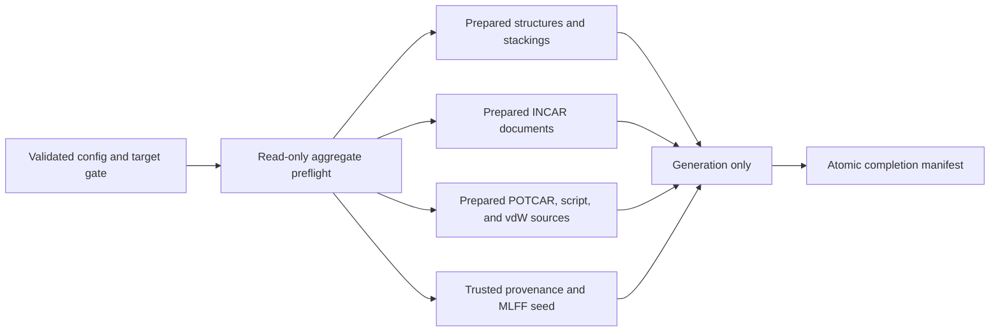
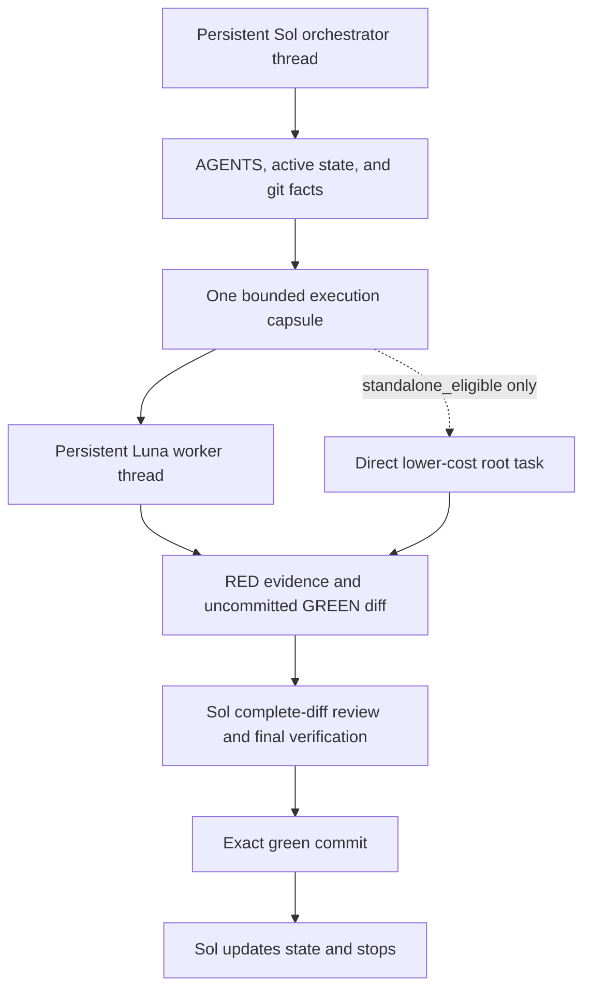

# Code Review Follow-up Route Correction and Low-reasoning Execution Design

Date: 2026-07-12

Status: approved; Plan 06R is under implementation.

## Purpose

The code-review follow-up has reached the end of Plan 06. The scientific build
path is broadly aligned with the approved notes, and the audited checkpoint at
`698b8a0` passes 302 tests with 6 documented skips. However, the audit found two
product-contract deviations, one omitted legacy diagnostic, growing module-boundary
debt, and execution metadata that is unsafe for a lower-reasoning implementation
model.

This design introduces a blocking Plan 06R before any new production leaf plan.
Plan 06R restores the approved manifest and preflight contracts, then bootstraps a
progressive-disclosure execution environment based on scoped `AGENTS.md` files, a
compact local active-state snapshot, and a short reusable execution prompt.

The design has two equally required outcomes:

1. the completed build path again matches the authoritative scientific and
   no-side-effect contracts; and
2. a lower-cost worker can execute exactly one orchestrator-issued, bounded TDD
   unit without loading the entire historical planning corpus, inventing state,
   committing, or advancing the plan.

## Audit Findings That Require Correction

### Stage0 grid-shift anchors use the wrong manifest location

P1-1 and the Manifest v2 shared contract define `grid_shift_anchors` as a
top-level manifest section. The current Stage0 producer stores the records under
`structure_provenance.grid_shift_anchors`, while the MD manifest uses the
top-level field. Current tests follow the Stage0 implementation rather than the
authoritative contract.

The internal producer and consumer therefore agree with each other but disagree
with the public schema. Leaving this until Plan 10 would create two persistent
locations for the same concept at the producer/consumer integration boundary.

### The aggregate preflight is not the single interpretation boundary

`preflight_stage0()` and `preflight_stage1()` return validated structures,
stackings, INCAR analysis, POTCAR choices, rcut, and seed/provenance values, but
generation reparses or recomputes most of them. In particular:

- symmetry-reduced stackings are selected after preflight and after `work_dir`
  creation;
- structure compatibility parsing creates a temporary normalized file beside an
  input POSCAR, even though it normally deletes that file;
- generation creates a new `StructureHandler`, resolves rcut again, reparses
  INCAR templates, and resolves POTCAR choices again.

This violates the approved guarantee that all discoverable failures occur before
filesystem mutation and that generation consumes one validated in-memory
interpretation.

### Successful legacy provenance inference is silent

The P1-5 authoritative note requires one explicit warning when Stage1 proceeds
through legacy provenance inference. The current implementation records
`legacy_inference` in the MD manifest but emits no user warning.

### Provenance ownership has moved into the preflight orchestrator

The roadmap assigns strict provenance validation and legacy inference to
`provenance.py`, while `build_preflight.py` should order validators and aggregate
diagnostics. The current preflight module contains most strict/legacy provenance
and anchor-validation logic and has grown to roughly 1,575 lines. Continuing this
pattern would make future low-reasoning edits increasingly unreliable.

### Runtime documentation is stale and internally contradictory

There is no repository `AGENTS.md`, although the reusable prompt requires one.
The roadmap still describes Plan 02 as active, the prompt contains a completed
Plan 02 migration exception, and the local status file combines the current
checkpoint with hundreds of lines of conflicting historical evidence. Several
historical RED-only commits also show that the existing long prompt did not
reliably enforce the green-checkpoint boundary.

## Goals

- Restore the top-level Stage0 `grid_shift_anchors` contract.
- Emit one deterministic warning for successful legacy provenance inference.
- Make preflight read-only with respect to both `input_dir` and `work_dir`.
- Select symmetry stackings and every other discoverable interpretation during
  preflight.
- Make generation consume prepared preflight values without reparsing or
  re-resolving domain inputs.
- Restore the documented ownership boundary between preflight orchestration and
  provenance rules.
- Insert Plan 06R as a blocking execution gate before Plans 07 and 09 and as an
  explicit predecessor of Plan 10.
- Introduce scoped, progressively disclosed agent instructions.
- Separate stable rules, dynamic execution state, and historical evidence.
- Make the reusable orchestrator and worker prompts short and state-independent.
- Separate high-reasoning orchestrator authority from lower-cost worker
  implementation authority.
- Use two persistent, model-specific conversations with explicit Sol/Luna, Max,
  and Standard UI selections plus a serial shared-worktree handoff.
- Retain direct lower-cost execution only for proven, low-risk, fully closed
  units, without granting commit or state-advance authority.
- Ensure every future commit is a green, independently reviewable checkpoint.

## Non-goals

- Do not implement Plan 07 OUTCAR ingestion, Plan 08 source collection, Plan 08A
  full-dedup, Plan 09 publication, or Plan 10 integration.
- Do not fix current direct-write collect behavior outside its approved later
  plans.
- Do not re-enable `stage: all` or submitted `--wait`.
- Do not implement MD restart, fuzzy deduplication, or deferred Slurm behavior.
- Do not add a generic workflow engine or machine-enforced task runner.
- Do not rewrite or squash historical commits, including historical RED-only
  commits.
- Do not install or change Python/conda packages.
- Do not create a permanent compatibility dialect for a schema error emitted
  only by the current unreleased development branch.

## Considered Governance Approaches

### One root AGENTS.md

A single file would be easy to discover, but it would accumulate plan routing,
module ownership, fixtures, and git rules into another monolithic prompt. Every
task would pay the full context cost and narrower rules would be difficult to
maintain.

### Scoped AGENTS.md files with a compact state and bootstrap prompt

Stable global rules live at the repository root. Plan execution, production
module ownership, and test/fixture rules live in narrower files. A compact local
state names the only active execution unit, while a short prompt loads just the
applicable context.

This is the selected approach.

### A machine-enforced execution controller

A controller could validate phase transitions, staging, and tests mechanically.
It would provide stronger enforcement but adds a new tool and maintenance surface
outside the current correction. It may be designed later if prompt plus scoped
instructions prove insufficient.

## Plan 06R Product-correction Design

Plan 06R depends on the completed Plans 04, 05, and 06. It is an execution-policy
gate: no new production work in Plan 07 or Plan 09 begins until 06R is green.
Plan 10 also gains an explicit dependency on Plan 06R.

Plan 06R is divided into four green checkpoint units. The future leaf plan will
specify exact tests and files; this design defines their boundaries and final
contracts.

### Unit 1: restore manifest and legacy-diagnostic contracts

New relaxation manifests write Stage0 anchor records only to top-level
`grid_shift_anchors`. `structure_provenance` continues to carry the structural
source, identities, and immutable Stage0 interpretation, but it no longer embeds
an anchor collection.

Strict Stage1 preservation reads only the top-level anchor section. MD manifests
continue using the same top-level section for final MD anchor identity. Tests
must assert that Stage0 and MD share one location and that nested anchor records
are not treated as the current schema.

The erroneous nested-only representation was emitted only by the current
unreleased branch. Plan 06R does not create a permanent dual-read contract. If
`preserve_grid_shift_md` is true and a development manifest has only the nested
record, Stage1 fails closed with a regeneration instruction. When preservation
is false, anchors are irrelevant and the existing unconditional-clearing path
may proceed if all other provenance checks pass.

When a valid legacy relaxation manifest is accepted through deterministic
inference, Stage1 emits exactly one warning per build invocation and records the
same inference result in the MD manifest.

### Unit 2: make structure and symmetry preflight pure and authoritative

POSCAR label normalization is performed through an in-memory text/file-object
path. Preflight must not create a temporary or persistent file in `input_dir` or
`work_dir`.

Preflight constructs the one `StructureHandler` or equivalent prepared structure
model used by generation. If symmetry reduction is enabled, it selects the exact
stacking list during preflight. Missing optional dependencies and symmetry
selection failures therefore occur before `work_dir` creation.

Stage0 and Stage1 generation consume the returned structures, stackings, rcut,
trusted provenance result, and parsed initial seed. They do not construct a
second structure interpretation or recompute these values.

### Unit 3: prepare and consume all remaining build inputs once

The immutable preflight result is extended with prepared domain inputs:

- parsed INCAR documents and their diagnostics;
- selected POTCAR source paths, ENMAX values, and source byte identities;
- the selected submit script and source identity;
- required vdW kernel selections and source identities;
- every validated output path.

INCAR generation renders from the parsed document returned by preflight. POTCAR,
submit-script, and vdW generation use the selected source paths rather than
running selection again. Large source files need not be retained in memory, but
generation verifies their recorded identity before copying so a changed source
cannot silently invalidate preflight.

This boundary removes duplicate interpretation without turning preflight into a
generic filesystem snapshot system.

### Unit 4: restore module ownership without changing behavior

`provenance.py` owns:

- structure identity and cell-relation primitives;
- strict current-manifest Stage1 provenance validation;
- deterministic legacy inference;
- provenance evidence results used by build and manifest producers;
- Stage0 anchor provenance validation where it depends on structure identity.

`build_preflight.py` owns:

- invoking domain validators in the approved order;
- aggregating stable diagnostics and warnings;
- enforcing the no-side-effect boundary;
- constructing the immutable prepared result.

`build.py` owns generation from that prepared result, including MD expansion and
final POSCAR writing. Plan 06R does not introduce unrelated build refactors or
move MD generation into a new framework.

## Preflight and Generation Data Flow

If preflight fails, neither `input_dir` nor `work_dir` changes. Once generation
begins, the existing one-shot failure contract remains: a runtime generation
failure may leave a partial target without a completion manifest, and the user
must explicitly delete that target before retrying.

## Progressive-disclosure AGENTS.md Hierarchy

Exactly four `AGENTS.md` instruction files are introduced. The two reusable
conversation prompts described below are launch and handoff documents, not a
fifth instruction layer.

### Repository root AGENTS.md

The root file contains only stable repository-wide rules:

- product-authority and runtime-state authority;
- the verified `vdwID` interpreter and no-install rule;
- one-green-execution-unit and no-RED-commit gates;
- precise staging, git safety, and no-push boundaries;
- private-data, POTCAR, and fixture prohibitions;
- preserved deferred Slurm/restart/fuzzy-dedup boundaries;
- instructions to read narrower files for edited paths.

It never contains HEAD, active-plan, current-test-count, or one-time migration
state.

### Plan-directory AGENTS.md

`docs/superpowers/plans/2026-07-11-code-review-followup/AGENTS.md` is the execution
controller and is explicitly read at startup even when production files will be
edited. It defines:

- how the active state selects one execution unit;
- the minimal document-read set;
- legal phase transitions;
- the adjacent RED-only plus exact GREEN pairing rule;
- the distinction between a local RED recovery point and a committable green
  checkpoint;
- contradiction and stop conditions;
- the rule that checkpoint completion ends the model run.

### Production AGENTS.md

`src/dpmoire_lite/AGENTS.md` lists module ownership and cross-module invariants.
It links to authoritative notes rather than copying scientific algorithms. In
particular, parsers do not publish, publication does not reinterpret sources,
and CLI code does not parse text logs to choose status.

### Test AGENTS.md

`tests/AGENTS.md` defines TDD, fixture provenance, private-data, focused/affected/
full-suite, platform skip, and external ASE validation rules. Tests may be RED
locally during an execution unit but may not be committed or left in default
discovery across units while failing.

Narrower instruction files may refine execution behavior for their directory,
but they cannot redefine authoritative scientific decisions. Each instruction
file has a hard maximum of 120 physical lines and uses links instead of
duplicated rules.

## Dual Execution Modes and Authority

The normal workflow uses two persistent threads attached to one shared worktree:
a Sol orchestrator conversation and a Luna worker conversation. They use a
serial handoff. Only one thread may inspect a changing worktree or write at a
time. Stable model-specific histories avoid repeatedly switching one long
conversation between profiles; the execution capsule carries only the bounded
cross-thread state.

Model selection is an external Codex UI action. Prompt text cannot switch or
prove the selected model, reasoning effort, or speed. The user selects Sol, Max,
Standard for the orchestrator thread and Luna, Max, Standard for the worker
thread. If Luna is unavailable, the user may explicitly select Terra with the
same settings. If neither lightweight profile is available, the orchestrator
executes the unit itself. No silent fallback is permitted.

### Persistent orchestrator thread

The Sol thread owns every decision that can change route or repository history:

- reconcile git facts with the compact active state;
- select the unique execution unit and read its authorities;
- classify whether it is orchestrator-only or worker-eligible;
- issue one copy-ready execution capsule containing the exact unit, fixed
  decisions, allowed files, pre-existing changes, required RED, RED handoff mode,
  focused/affected/full commands, non-goals, stop conditions, and evidence shape;
- validate the worker's expected RED before accepting production code;
- inspect the complete worker diff and resolve semantic or scope questions;
- run final verification, explicitly stage files, audit the cached diff, create
  the green checkpoint commit, and update active state.

Only this thread may modify the roadmap, specs, leaf plans, or active-state
snapshot; stage or commit; or advance to another unit. It may use parallel agents
only for independent read-only exploration, test analysis, or review.

### Persistent worker thread

The Luna thread receives an execution capsule from the orchestrator and
implements only that capsule. It may edit allowed tests and production files,
run read-only Git inspection, and execute the specified suites. For every
behavior change it follows RED-GREEN-REFACTOR in order and returns the RED
command, exit status, expected failure, GREEN evidence, changed files, and any
ambiguity.

The capsule states whether the worker returns immediately after RED or may
continue to minimal GREEN. The first calibration and every subtle failure
boundary use a split RED return. A fully closed, low-risk capsule may authorize a
single-turn RED-GREEN cycle only after the supervised threshold is met.

The worker stops without implementation if the capsule is missing,
contradictory, disagrees with Git/active state, or requires an authority choice.
It cannot select a task, widen allowed files, change plans/specs/state, stage,
commit, push, or delegate. Its output is an uncommitted worktree plus evidence.

### Serial handoff protocol

1. Sol reconciles the worktree, locks exactly one unit, updates ignored state if
   needed, and emits a copy-ready capsule.
2. Sol stops and yields the worktree. The user then pastes the capsule into the
   persistent Luna thread.
3. Luna runs the read-only preflight and performs only the authorized TDD phase.
4. For split RED, Luna stops after evidence; Sol reviews it and emits a GREEN
   continuation, then stops before Luna resumes.
5. After GREEN, Luna leaves every change unstaged, reports evidence, and stops.
6. Only then does Sol resume, review the full diff, run final gates, stage exact
   files, commit, advance state to the next `inspect`, and stop.

Native named-agent loading is not a governance gate because the currently
exposed tool-backed runtime does not provide proof of per-subagent model/profile
selection. It may be reintroduced only through a separate amendment after the
target runtime exposes verifiable loading and metadata.

### Direct lower-cost mode

Pasting the worker prompt into a standalone lower-cost root task remains a
fallback, not the normal path. A unit is eligible only when all are true:

- governance bootstrap and the two-thread no-write handoff drill are green;
- at least two supervised worker units completed without authority, scope, or
  TDD-protocol violations;
- the leaf plan or orchestrator-issued capsule marks `standalone_eligible`;
- behavior, allowed files, RED, test commands, and stop conditions are closed;
- the unit changes no scientific interpretation, schema, compatibility policy,
  recovery boundary, architecture, or cross-plan contract;
- no unknown worktree change overlaps its files.

Direct mode retains the worker restrictions. It stops with uncommitted changes
and evidence; the Sol thread later reviews, verifies, commits, updates state, and
chooses the next unit. Failure of any condition routes the unit back to the
supervised two-thread mode.

## Active-state Design

The existing local status file is preserved as
`IMPLEMENTATION-HISTORY.local.md`. It remains ignored and is not read during
normal execution.

A new compact `IMPLEMENTATION-STATUS.local.md` is the only runtime snapshot. It
is also ignored and never staged. It is limited to 80 physical lines and
contains:

- updated time, branch, and verified HEAD;
- active plan, execution unit, task numbers, and phase;
- last green checkpoint;
- exact allowed files and current owned changes;
- evidence for the current unit only;
- blockers;
- one exact next action;
- the first resume commands.

It does not contain completed-plan histories. Git commits and the archived local
file provide historical evidence.

Legal active phases are `inspect`, `red`, `green`, `verify`, `commit`, and
`blocked`. At a plan boundary, the next approved unit is named and phase is
`inspect`; no separate ambiguous `checkpoint` phase is used.

If state is missing or disagrees with git, the model performs one read-only
reconstruction run, writes the corrected snapshot, and stops. It must not both
reconstruct uncertain state and begin production modification in the same run.
It never resolves disagreement through reset, checkout, clean, deletion, or
absorption of unknown changes.

## Versioned Status Text

Versioned design and roadmap documents must not claim a dynamic active plan.
Their status text is normalized as follows:

- the roadmap is an approved roadmap whose runtime progress lives in the local
  status file;
- the original `93 passed, 5 skipped` value is explicitly historical, not the
  current suite result;
- the decomposition design is marked approved and under implementation;
- the full-dedup design is marked approved and incorporated into notes/plans.

The authoritative scientific content is unchanged by these status corrections.

## Reusable Execution Prompts

[`ORCHESTRATOR-EXECUTION-PROMPT.md`](../plans/2026-07-11-code-review-followup/ORCHESTRATOR-EXECUTION-PROMPT.md)
is at most 120 physical lines. It bootstraps the persistent Sol thread, performs
state recovery and planning, emits a copy-ready capsule, stops for serial
handoff, then reviews the complete unstaged and cached diffs before commit and
active-state advance.

[`WORKER-EXECUTION-PROMPT.md`](../plans/2026-07-11-code-review-followup/WORKER-EXECUTION-PROMPT.md)
is at most 80 physical lines. It bootstraps the persistent Luna thread, requires
an orchestrator-issued capsule, reads active state only for agreement, follows
the fixed RED handoff, reports evidence, leaves all changes unstaged, and stops.

Both prompts state their recommended UI profile but explicitly acknowledge that
prompt text cannot select or prove it. They define two persistent threads, the
shared worktree, serial handoff, and one-writer boundary. They remove hard-coded
Plan 02 state, migration exceptions, speculative RED inventories, and copied
scientific rules.

## Execution Context Flow

## Implementation and Handoff Sequence

1. Commit this approved design document alone.
2. Obtain user review of the written specification.
3. Write the Plan 06R leaf implementation plan and roadmap amendment.
4. Execute a governance-bootstrap unit with a high-reasoning model:
   - create the four `AGENTS.md` files;
   - archive and compact local state;
   - create the Sol orchestrator and Luna no-commit worker prompts;
   - define their persistent-thread UI profiles and serial handoff;
   - normalize versioned status text;
   - set the active state to the first Plan 06R product unit.
5. Dry-run one read-only orchestrator resume using only the new bootstrap path.
6. Run a no-write worker-contract drill, then use the first eligible Luna unit to
   validate the split RED/GREEN serial handoff and actual UI-selected profile.
7. Permit Sol to issue later eligible units to the persistent Luna thread one at
   a time; retain high-reasoning execution for architectural or contract-heavy
   units.
8. Keep direct lower-cost mode closed until its two-success eligibility threshold
   is met.
9. Keep Plans 07 and 09 closed until Plan 06R is complete.
10. After Plan 06R passes, set Plan 07 Task 1 as the next active unit.

## Testing and Quality Gates

### Governance bootstrap

- exactly the four designed `AGENTS.md` files exist;
- root/narrow instructions contain no HEAD or active-plan state;
- orchestrator prompt has at most 120 physical lines; worker prompt and active
  state each have at most 80;
- obsolete Plan 02 migration and RED-inventory language is absent;
- both prompts define Sol/Luna Max Standard as external UI choices, two
  persistent threads, serial handoff, and one shared-worktree writer;
- the worker prompt denies plan selection, state mutation, staging, commit, push,
  and nested delegation;
- active state has one active unit and one exact next action;
- local status and history files are absent from the staged set;
- a read-only resume drill reaches the intended active unit without reading
  historical status;
- a no-write contract drill leaves the worktree unchanged, and the first Luna
  implementation demonstrates a Sol-validated RED before GREEN.

### Product correction

Each unit must record a valid RED, focused GREEN, affected suites, full suite,
`git diff --check`, exact staging, cached-diff inspection, and a green local
commit. No RED-only commit is allowed.

The final Plan 06R gate proves:

- Stage0 anchors exist only at the top-level manifest location;
- legacy inference warns exactly once;
- preflight writes neither the input tree nor work tree;
- symmetry and other discoverable interpretation happen during preflight;
- generation does not reparse validated structures, INCAR, or POTCAR selection;
- preflight and provenance module ownership matches the roadmap;
- the complete suite and repository-hygiene audits pass;
- deferred safety boundaries remain unchanged.

## Failure and Recovery Rules

- State/git disagreement causes state correction and stop, not implementation.
- Invalid RED, failed tests, or an out-of-scope diff cannot be committed.
- Worker output is never committed or used to advance state before orchestrator
  review and final verification.
- Each green unit is an independent commit and rollback/review boundary.
- Existing history is not rewritten to hide earlier protocol violations.
- A new scientific contradiction returns to design/spec review; the execution
  model does not select a rule ad hoc.
- Nested-only development anchor manifests fail closed for preservation with a
  regeneration diagnostic instead of creating a permanent second schema.

## Acceptance Criteria

- Plan 06R is present in the roadmap and blocks further production execution.
- All three audited product deviations are closed by explicit tests.
- The preflight result is the single prepared build-input contract.
- Provenance and preflight responsibilities match their documented ownership.
- The repository contains exactly four concise, scoped `AGENTS.md` files.
- The project contains bounded Sol and Luna execution prompts with external UI
  profile selection and a serial shared-worktree handoff.
- Stable instructions contain no dynamic execution state.
- Active execution state is compact, unambiguous, local-only, and recoverable
  from git facts.
- The worker prompt contains no obsolete migration or duplicated science and has
  no commit or state-advance authority.
- A read-only resume drill selects exactly one intended unit.
- Orchestrator and worker responsibilities are non-overlapping, and direct
  lower-cost mode is mechanically identifiable through the eligibility marker.
- Every new checkpoint commit is full-suite green.
- Plan 07 does not begin until Plan 06R and its final gate are complete.
